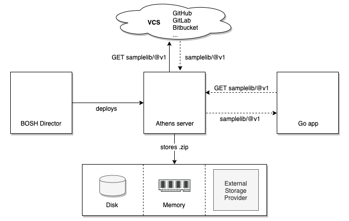

[](https://github.com/s4heid/athens-bosh-release/actions)

# athens-bosh-release

This BOSH release provides jobs for running the [Athens](https://docs.gomods.io) project in a BOSH environment.


## Architecture




## Usage

Upload the bosh release to your director from the command line with the `upload-releases` command:

```sh
$ bosh upload-release --name=athens --version=0.1.1 \
    git+https://github.com/s4heid/athens-bosh-release
```

Or reference it in the `releases` section of your deployment manifest:

```yaml
releases:
- name: athens
  version: 0.1.1
  url: git+https://github.com/s4heid/athens-bosh-release
```

Add the athens job to an instance group in the deployment manifest, e.g.

```yaml
instance_groups:
- name: athens
  persistent_disk: 1024
  jobs:
  - name: athens
    release: athens
    properties:
      storage_type: disk
```

The above example configures the persistent disk as storage provider.


## Getting Started

The following section explains how to set up different environments for deploying the athens-bosh-release and running the integration tests.

### bosh-lite

If you only want to run the tests against a local athens VM, the easiest way to get started is probably bosh-lite. Step by step instructions on how to spin up a bosh-lite environment are given in the [bosh docs](https://bosh.io/docs/bosh-lite).

### bosh-bootloader (aws)

Deploying a bosh with [bosh-bootloader](https://github.com/cloudfoundry/bosh-bootloader) (bbl) is another possibility to get started. Assuming you have already installed a bosh on AWS as described in [this guide](https://github.com/cloudfoundry/bosh-bootloader/blob/master/docs/getting-started-aws.md), you need to set up a few additional things in the infrastructure. This can be achieved by running

```sh
$ cp ci/terraform/terraform.tfvars{.template,}
```

inside the athens-release root directory and filling in the missing parameters. Thereafter, execute the following script to create the required infrastructure components:

```sh
$ AWS_ACCESS_KEY_ID="..." AWS_SECRET_ACCESS_KEY="..." ./scripts/tf-apply.sh
```

The script will prompt you to log in to your lastpass account, as it will sync the terraform state with a lastpass secret note.


## Development

After [setting up your bosh environment](#getting-started), deploy an athens server and run the integration tests by executing

```sh
$ ./scripts/test.sh
```


## License

[Apache License, Version 2.0](./LICENSE)
